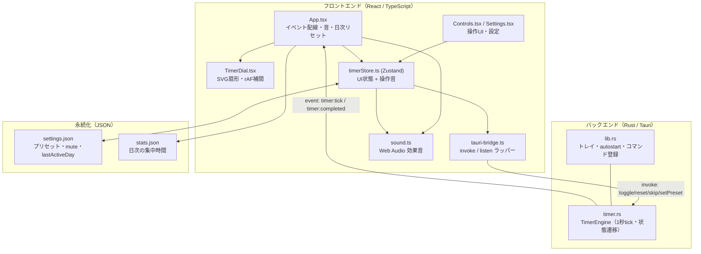
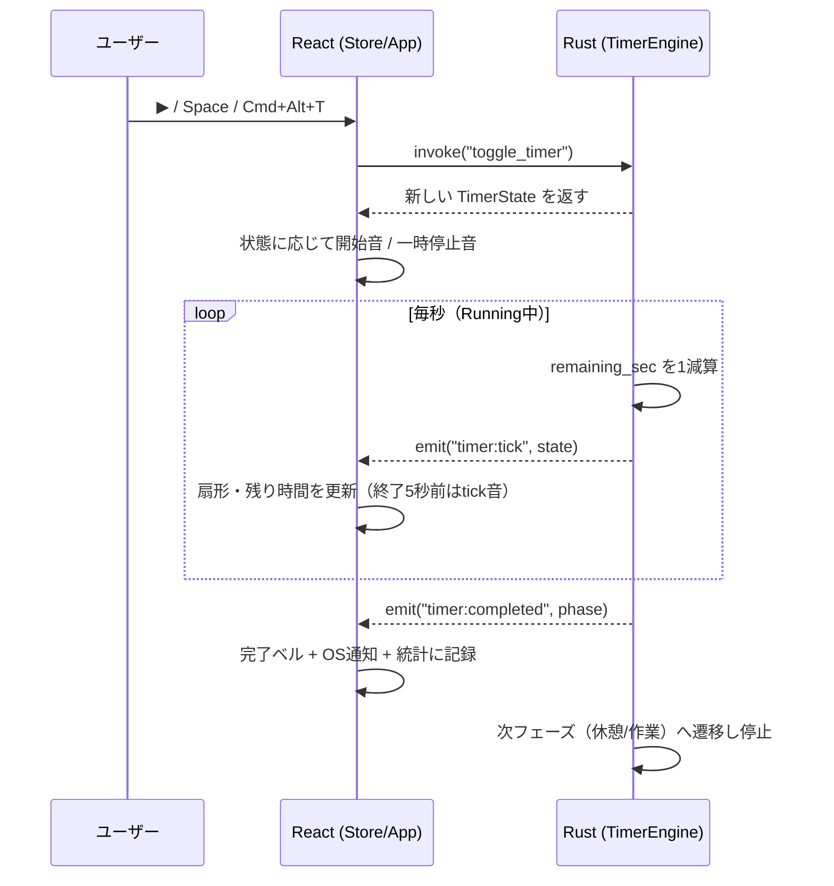
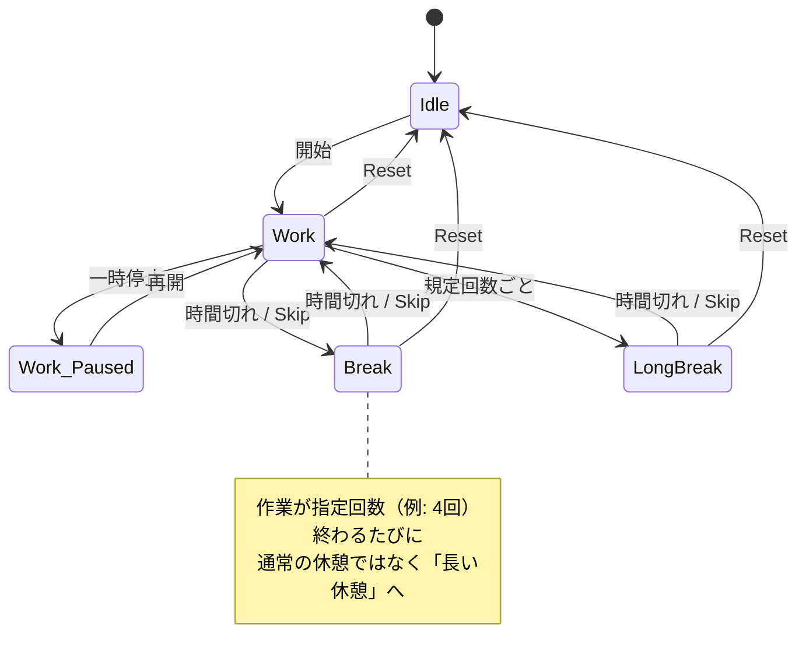

# TimeTimer

作業中ずっと最前面に浮かぶ、円形の視覚タイマー。残り時間が扇形（セクター）で減っていくので、数字を読まなくても「あとどれくらいか」が一目でわかります。ポモドーロ等と組み合わせて集中を維持するための macOS 常駐アプリです。

> Tauri v2 + React + TypeScript 製。メモリ約30〜40MB、バイナリ10MB以下と軽量です。

---

## 目次

- [何ができるか](#何ができるか)
- [画面の見方](#画面の見方)
- [技術スタック](#技術スタック)
- [アーキテクチャ](#アーキテクチャ)
- [データの流れ](#データの流れ)
- [タイマーの状態遷移](#タイマーの状態遷移)
- [ディレクトリ構成](#ディレクトリ構成)
- [セットアップと開発](#セットアップと開発)
- [ビルドとインストール](#ビルドとインストール)
- [操作方法](#操作方法)
- [設定とデータの保存先](#設定とデータの保存先)
- [仕組みの詳細](#仕組みの詳細)
- [トラブルシューティング](#トラブルシューティング)

---

## 何ができるか

| 機能 | 説明 |
|------|------|
| 円形ビジュアルタイマー | 残り時間が扇形で減少。作業=赤 / 休憩=緑 / 長い休憩=青で色分け |
| 常に最前面 + 全デスクトップ表示 | 他アプリを使っていても見える。ウィンドウ枠なし・背景透過 |
| ポモドーロ対応 | 作業→休憩を自動で切り替え、規定回数ごとに長い休憩を挿入 |
| プリセット | Pomodoro 25-5 / 52-17 / Deep Work 90min を内蔵。カスタムも可 |
| グローバルショートカット | 他アプリ最前面でも `Cmd+Alt+T` で開始/一時停止 |
| 音のフィードバック | 開始/一時停止の操作音、終了5秒前のカウントダウン、完了ベル |
| 日次リセット | 毎日 28:00（午前4時）にセッション進捗を自動で0へ |
| 統計 | 直近7日の集中時間をミニ棒グラフで表示（30日分を保持） |
| システムトレイ | メニューバーから操作。ログイン時自動起動にも対応 |
| サイズ可変 | 64px〜400pxにリサイズ。小さくすると数字を隠して扇形だけ表示 |

---

## 画面の見方

```
            ┌─────────────────┐
            │     ╭───────╮    │   ← 扇形（残り時間ぶんだけ残る）
            │    │  24:13  │   │   ← 残り時間
            │    │  Focus  │   │   ← フェーズ名（Focus/Break...）
            │     ╰───────╯    │
            │   3/8 · 2h · 14:05  │ ← セッション進捗 / 累計集中 / 現在時刻
            └─────────────────┘
```

ウィンドウにマウスを乗せると操作ボタン（▶ ↺ ⏭ 🔔 ⚙）が浮かび上がります。背景をドラッグすると移動できます。

---

## 技術スタック

| 領域 | 採用 | 役割 |
|------|------|------|
| アプリ基盤 | **Tauri v2** | Rust製の軽量デスクトップ枠（Electron代替） |
| UI | **React 19 + TypeScript** | 宣言的UI・型安全 |
| タイマー描画 | **SVG** | viewBoxでリサイズ追従、扇形をパスで描画 |
| 状態管理 | **Zustand** | 軽量ストア。Rust↔React間の状態同期 |
| ビルド | **Vite 7** | フロントエンドの高速ビルド |
| 永続化 | **tauri-plugin-store** | 設定・統計をJSONで保存 |
| 通知・音 | **plugin-notification / Web Audio API** | OS通知と手続き生成の効果音 |
| ショートカット | **plugin-global-shortcut** | アプリ非フォーカス時のキー操作 |
| 自動起動 | **plugin-autostart** | ログイン時に起動 |

---

## アーキテクチャ

Rust（バックエンド）が「時間を刻む唯一の真実」を持ち、React（フロントエンド）は表示と入力に専念します。両者は Tauri の `invoke`（命令）と `event`（通知）でつながります。



ポイント: タイマーのカウントは **Rust 側の専用スレッド**が担当します。フロントを閉じても（理論上）時間はずれません。React は受け取った残り秒を描画し、滑らかさは `requestAnimationFrame` で補間します。

---

## データの流れ

「開始ボタンを押してから音が鳴り、毎秒UIが更新されるまで」の流れです。



---

## タイマーの状態遷移

フェーズ（作業/休憩）とステータス（実行/一時停止/停止）の2軸で管理しています。



各フェーズ完了時はいったん **Stopped** になり、ユーザーが手動で次を開始します（自動連続再生はしません）。

---

## ディレクトリ構成

```
timeTimer/
├── src/                        # フロントエンド（React）
│   ├── App.tsx                 # イベント配線・音のunlock・日次リセット
│   ├── main.tsx                # エントリポイント
│   ├── components/
│   │   ├── TimerDial.tsx       # SVG円形セクター（rAFで滑らかに補間）
│   │   ├── Controls.tsx        # ホバーで出る操作ボタン
│   │   ├── Settings.tsx        # 設定画面・統計グラフ・自動起動トグル
│   │   └── SessionInfo.tsx     # セッション情報表示
│   ├── stores/
│   │   └── timerStore.ts       # Zustandストア（UI状態 + 操作音）
│   ├── lib/
│   │   ├── tauri-bridge.ts     # invoke / listen のラッパー
│   │   ├── sound.ts            # Web Audio による効果音
│   │   ├── dailyReset.ts       # 28:00基準の日次リセット
│   │   ├── stats.ts            # 日次集中時間の記録・集計
│   │   ├── arc.ts              # SVGアーク（扇形）計算
│   │   └── format.ts           # 時間フォーマット
│   └── types/
│       └── timer.ts            # 型定義・デフォルトプリセット
│
├── src-tauri/                  # バックエンド（Rust）
│   ├── src/
│   │   ├── main.rs             # 起動エントリ
│   │   ├── lib.rs              # トレイ・autostart・コマンド登録
│   │   └── timer.rs            # タイマーエンジン本体（tick・遷移）
│   ├── capabilities/default.json  # 権限定義
│   ├── icons/                  # アプリアイコン各サイズ
│   ├── Cargo.toml
│   └── tauri.conf.json         # ウィンドウ・バンドル設定
│
├── package.json
└── vite.config.ts
```

---

## セットアップと開発

### 前提

- macOS
- [Node.js](https://nodejs.org/) 18以上
- [Rust](https://www.rust-lang.org/tools/install)（`rustup` 経由を推奨）

### 開発起動

```bash
# 依存をインストール
npm install

# ホットリロード付きで起動（フロント+Rustを同時ビルド）
npm run tauri dev
```

`npm run tauri dev` は内部で Vite（`http://localhost:1420`）と Rust ビルドを立ち上げます。

---

## ビルドとインストール

```bash
# リリースビルド（.app と .dmg を生成）
npm run tauri build
```

成果物の場所:

```
src-tauri/target/release/bundle/macos/TimeTimer.app   # アプリ本体
src-tauri/target/release/bundle/dmg/TimeTimer_0.1.0_x64.dmg
```

`/Applications` へ配置すると Raycast や Finder から検索・起動できます:

```bash
ditto src-tauri/target/release/bundle/macos/TimeTimer.app /Applications/TimeTimer.app
```

> グローバルショートカットを使うには、macOS の **システム設定 → プライバシーとセキュリティ → アクセシビリティ** で TimeTimer を許可してください。

---

## 操作方法

### キーボードショートカット

| 操作 | グローバル（他アプリ最前面でも有効） | アプリ内 |
|------|------------------------------------|---------|
| 開始 / 一時停止 | `Cmd + Alt + T` | `Space` |
| リセット | — | `R` |
| スキップ | — | `S` |
| ミュート切替 | — | `M` |
| 設定を開く | — | `Cmd + ,` |

### 操作ボタン（ウィンドウにホバーで表示）

| ボタン | 機能 |
|--------|------|
| ▶ / ⏸ | 開始 / 一時停止 |
| ↺ | リセット |
| ⏭ | スキップ（次フェーズへ） |
| 🔔 / 🔇 | ミュート切替 |
| ⚙ | 設定 |

### システムトレイ（メニューバー）

Start/Pause・Reset・Skip・Show Window・Quit を選べます。

### マウス操作

- **背景をドラッグ**: ウィンドウ移動
- **端をドラッグ**: リサイズ（64〜400px）

---

## 設定とデータの保存先

`tauri-plugin-store` が以下のJSONを app config 配下（例: `~/Library/Application Support/com.fuma.timetimer/`）に保存します。

| ファイル | 内容 |
|----------|------|
| `settings.json` | アクティブなプリセット・カスタム値・ミュート・目標セッション数・`lastActiveDay` |
| `stats.json` | 日次の集中時間と完了セッション数（直近30日分） |

---

## 仕組みの詳細

### 音が「クリックでは鳴らずキーでは鳴る」問題への対処

Web Audio の `AudioContext` は autoplay ポリシーで最初 `suspended`（停止）状態になり、WKWebView はアプリが非フォーカスになるたびに再び suspend します。`resume()` は非同期なので、停止中のまま音をスケジュールすると無音になります。

`sound.ts` の `playWhenReady()` は **`resume()` の完了を待ってから**音を生成します。これで、ウィンドウを再フォーカスするクリック操作（クリック時点ではcontextが停止）でも、すでにフォーカス済みのキーボード操作でも、同じように音が鳴ります。加えて初回の `pointerdown`/`keydown` で `unlockAudio()` を呼び、以降のイベント駆動音（tick/ベル）やバックグラウンドのショートカット音も鳴るようにしています。

### 28:00（午前4時）の日次リセット

`dailyReset.ts` は午前4時を境にした「論理的な1日」を計算します（0〜3時台は前日扱い）。前回起動日を `settings.json` の `lastActiveDay` に保存し、60秒ごとに日付が変わったか確認。変わっていればセッション進捗をリセットします。深夜作業中に勝手に0に戻らない設計です。

### 扇形の滑らかな減少

Rust からは1秒ごとに残り秒が届きますが、そのままだと1秒刻みでカクつきます。`TimerDial.tsx` は `requestAnimationFrame` で目標角度へ毎フレーム補間し、ズレが大きいときだけスナップさせて滑らかに見せています。

---

## トラブルシューティング

| 症状 | 対処 |
|------|------|
| グローバルショートカットが効かない | システム設定のアクセシビリティで TimeTimer を許可 |
| 音が鳴らない | アプリ起動後に一度ウィンドウをクリック（音声を有効化）。それでも鳴らなければ最新ビルドへ更新 |
| Finder/Raycastに出てこない | `.app` を `/Applications` に配置 |
| フルスクリーンアプリの上に出ない | macOSの仕様で前面化できない場合あり。通常ウィンドウでは最前面表示 |

---

## ライセンス

個人利用向けプロジェクト。`macos-private-api` を使用しているため App Store 配布はできません（ローカルビルド／配布は可）。
